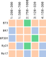
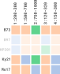
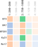

```{r setup, include=FALSE}
knitr::opts_chunk$set(
  fig.align = "center",
  external = TRUE,
  echo = TRUE,
  warning = FALSE
)

library(rPHG2)
library(GenomicRanges)

source("../tests/testthat/setup.R")
```

The basic workflow of the `rPHG2` package is as follows:

1.  Create a connection object
2.  Read data into the R environment
3.  Analyze and visualize data retrieval

This document introduces you to `rPHG2`'s methods and grammar, and
shows you how to apply them to the previously mentioned workflow.


## Creating connection objects
rPHG objects can be created through two primary sources:
* local data
* server connections

Creating initial "connection" objects helps unify downstream reading and
evaluation steps for PHGv2 data. In the next couple of sections, we will show
you how to create either local or server connnection objects.


### Local data
_Local_ connections are for local TileDB instances or direct locations of 
[hVCF](https://github.com/maize-genetics/phg_v2/blob/main/docs/hvcf_specifications.md)
files on a local disk. To create a local connection, we will create a
`PHGLocalCon` object using the following constructor function:

```{r, eval=FALSE, echo=TRUE}
PHGLocalCon()
```

For the above example, we will create a connection to some example local hVCF 
files provided with the `rPHG2` package:

* `LineA.h.vcf`
* `LineB.h.vcf`

Since the full paths to these files will differ between each user, we can
use the `system.file()` function to get the full path:

```{r, eval=FALSE, echo=TRUE}
system.file("extdata", "LineA.h.vcf", package = "rPHG2")
```

This will get the full path from the `extdata` directory for the file, 
`LineA.h.vcf`, found in the `rPHG2` source code.

We can further build on this to create a collection of full file paths to our
hVCF data:

```{r, eval=TRUE, echo=TRUE}
hVcfFiles <- system.file(
    "extdata", 
    c("LineA.h.vcf", "LineB.h.vcf"), 
    package = "rPHG2"
)
```


Now that we have a collection of hVCF files, we can use the `PHGLocalCon()`
constructor function to create a `PHGLocalCon` object:

```{r, eval=TRUE, echo=TRUE}
localCon <- hVcfFiles |> PHGLocalCon()

localCon
```

From here, we can move to the [next section](#creating-jvm-objects) to create a `HaplotypeGraph`
object interface with the JVM.


### Server connections

> **Note**
>
> We are still actively working on this section and will not have the same
> compatibility as [rPHG](https://rphg.maizegenetics.net/articles/rphg_walkthrough.html#establishing-a-server-connection).
> Stay tuned for further details!

Conversely, _server_ locations are for databases served on publicly available
web services leveraging the [Breeding API (BrAPI) endpoints](https://brapi.org/).
Since this is a connection to a server, a URL path instead of a local file
path will be needed. We will use the `PHGServerCon()` constructor function
to create a `PHGServerCon` object:

```{r, eval=TRUE, echo=TRUE}
srvCon <- "phg.maizegdb.org" |> PHGServerCon()

srvCon
```

In the above example, we have made the assumptions that this URL:

1. Uses a secure transfer protocol ([`https`](https://en.wikipedia.org/wiki/HTTPS))
2. Uses default ports for data serving
3. Has BrAPI specified endpoints

For points **1** and **2**, if the URL uses non-secure protocols ("http")
and/or has a modified port number, you will need to specify these with the
`protocol` and `port` parameters in the constructor function. For example:

```{r, eval=FALSE, echo=TRUE}
"www.my-unsecure-phg.org" |> 
    PHGServerCon(
        port     = 5300, 
        protocol = "http"
    )
```

For point **3**, if the constructor cannot resolve 
[mandatory endpoints](https://app.swaggerhub.com/apis/PlantBreedingAPI/BrAPI-Core/2.1#/Server%20Info/get_serverinfo),
an exception will occur.


## Creating JVM objects

> **Note**
>
> This will require the `rJava` package to be installed along with a modern
> version of Java (e.g., $\geq$ v17) to work properly!

Now that we have either a local or server-based connection object, we can
convert the raw hVCF data into a 
[`HaplotypeGraph`](https://github.com/maize-genetics/phg_v2/blob/main/src/main/kotlin/net/maizegenetics/phgv2/api/HaplotypeGraph.kt)
JVM object and bridge the Java reference pointer to R. Before we build the JVM 
graph object, we need to initialize the JVM and add the JAR files to our 
environment that are found within the [latest distribution](https://github.com/maize-genetics/phg_v2/releases) 
of PHGv2. 

**Note:** If you have **not** downloaded this, _please_ see instructions
[here](https://phg.maizegenetics.net/installation/#get-phgv2) before you
continue! 

To initialize, run the following command:

```{r, eval=FALSE, echo=TRUE}
initPhg("phg/path/to/lib")
```

...where `phg/path/to/lib` is the `lib` directory found within the decompressed
release of PHGv2. Now that the JVM has been initialized, we can build the JVM
graph using `buildHaplotypeGraph()` using the local connection object as input:


```{r, eval=TRUE, echo=TRUE}
graph <- localCon |> buildHaplotypeGraph()

graph
```

In the above example, we took the local connection object and passed it into
a `HaplotypeGraph` constructor. Here, we have a basic class that contains a
pointer object where we can direct data from Java to R:

```{r, eval=TRUE, echo=TRUE}
graph |> javaRefObj()
```

### Returning version and memory values
Since we need to construct an interface to a local instance of Java, errors
may arise due to several issues. Two common causes are version issues and
memory allocated to the JVM. For debugging and monitoring purposes, we can
use the `jvmStats()` function which creates a instance of a `JvmStats` object.

```{r, eval=TRUE, echo=TRUE}
javaStats <- jvmStats()

javaStats
```

This object contains several values:

* Total number of PHGv2 JAR files added to the class path
* Your local Java version
* The current PHGv2 version added to the class path
* Current memory allocation to the JVM (recorded in gigabytes [`GB`])


## Reading data
Now that we have created a `HaplotypeGraph` object, we can begin **read**ing
data using the `read*` family of `rPHG2` functions.


### Sample IDs
To return a vector of sample IDs from the graph object, we can use the 
`readSamples()` function:

```{r, eval=TRUE, echo=TRUE}
graph |> readSamples()
```


### Reference ranges
To return information about all reference ranges found within the graph object,
we can use the `readRefRanges()` function. This will return a `GRanges` object
which is a common data class in the 
[`GenomicRanges`](https://bioconductor.org/packages/release/bioc/html/GenomicRanges.html) 
package:

```{r, eval=TRUE, echo=TRUE}
graph |> readRefRanges()
```


### Haplotype IDs
To return all haplotype IDs as a "sample $\times$ reference range" `matrix`
object, we can use the `readHapIds()` function:


```{r, eval=TRUE, echo=TRUE}
m <- graph |> readHapIds()

# Show only first 3 columns
m[, 1:3]
```


### Haplotype ID metadata
To return metadata for each haplotype ID as a `tibble` object, we can use 
the `readHapIdMetaData()` function:

```{r, eval=TRUE, echo=TRUE}
graph |> readHapIdMetaData()
```


### Haplotype ID metadata (positions)
To return positional information for each haplotype ID as another `tibble`
object, we can use the `readHapIdPosMetaData()` function:

```{r, eval=TRUE, echo=TRUE}
graph |> readHapIdPosMetaData()
```


### All hVCF data
In a majority of cases, we may need more than one piece of hVCF data. We can
read all of the prior data simultaneously as `PHGDataSet` object which is
an in-R-memory representation of all hVCF data:

```{r, eval=TRUE, echo=TRUE}
phgDs <- graph |> readPhgDataSet()
phgDs
```

If this object is created, we can use the prior `read*` methods to 
instantaneously pull out the previously mentioned R data objects:

* `readSamples()`
* `readRefRanges()`
* `readHapIds()`
* `readHapIdMetaData()`
* `readHapIdPosMetaData()`


## Filter data
In some cases, you may want to query information and focus on one
specific reference range and/or sample(s). We can **filter** our `PHGDataSet`
objects using the `filter*` family of functions.

For the following examples, let's picture our primary data as a 2-dimensional
`matrix` of:

* samples (rows)
* reference ranges (columns)
* hap ID data (elements)

If we were to represent this as an object in R called `phgDs`, it would look 
like the following diagram:

```{r, eval=TRUE, echo=TRUE}
phgDs
```

{fig.align="center"}

...where each individual colored cell is a haplotype ID.


### Filter by sample
If we want to filter based on sample ID, we can use the `filterSamples()`
function. Simply add the sample ID or collection of sample IDs as a `character`
string or a vector of `character` strings, respectively. Using the prior
diagram as a reference, I will filter out anything that is not the following:

* `B73`
* `Ky21`
* `Mo17`

```{r, eval=FALSE, echo=TRUE}
phgDs |> filterSamples(c("B73", "Ky21", "Mo17"))
```

{fig.align="center"}

**Note**: If samples are added to the filter collection, but are not
present in the data, they will be discarded. If **no** samples are found, an
exception will be thrown stating that no samples could be found.


### Filter by reference range
If we want to filter based on sample ID, we can use the `filterRefRanges()`
function. Currently, this takes a `GRanges` object where we can specify
integer-based ranges located in genomic regions by chromosome (i.e., 
`seqnames`). For example, if I want to return all ranges that intersect with
the following genomic regions:

| Chromosome | Start (bp) | End (bp) |
|------------|------------|----------|
| `"1"`      | `100`      | `400`    |
| `"2"`      | `400`      | `900`    |

I can create the following `GRanges` object and pass that to the filter
method:

```{r, eval=FALSE, echo=TRUE}
gr <- GRanges(
    seqnames = c("1", "2"),
    ranges = IRanges(
        c(100, 800),
        c(400, 900)
    )
)


phgDs |> filterRefRanges(gr)
```




### Chaining methods
Since we have two dimensions, we can filter simultaneously by "piping" or
combining filter methods in one pass:

```{r, eval=FALSE, echo=TRUE}
gr <- GRanges(
    seqnames = c("1", "2"),
    ranges = IRanges(
        c(100, 800),
        c(400, 900)
    )
)

phgDs |> 
    filterSamples(c("B73", "Ky21", "Mo17")) |> 
    filterRefRanges(gr)
```


## Summarize and visualize data

In addition to parsing multiple hVCF files into R data objects via a 
`PHGDataSet`, rPHG2 also provides functions to summarize and visualize data.


### Global values

To begin, we can return general values on the number of observations within
our dataset using the `numberOf*` family of functions:

```{r, eval=TRUE, echo=TRUE}
phgDs

# Get number of samples/taxa
phgDs |> numberOfSamples()

# Get number of chromosomes
phgDs |> numberOfChromosomes()

# Get number of reference ranges
phgDs |> numberOfRefRanges()

# Get number of haplotype IDs
phgDs |> numberOfHaplotypes()
```


### Get counts of unique haplotype IDs
To get the unique number of haplotypes per reference range in our `PHGDataSet`
object, we can use `numberOfHaplotypes()` again, but set the internal parameter
`byRefRange` to `TRUE`:

```{r, eval=TRUE, echo=TRUE}
phgDs |> numberOfHaplotypes(byRefRange = TRUE)
```


### Visualize counts of unique haplotype IDs
We can visualize the prior section using a member of the `plot*` family of
functions, `plotHaploCounts()`. By default, this will produce a scatter plot of
data found across all reference ranges in the reference genome (similar to a
[Manhattan plot](https://en.wikipedia.org/wiki/Manhattan_plot)):

```{r, eval=TRUE, echo=TRUE}
phgDs |> plotHaploCounts()
```

To get more "granular" views of specific regions within our data, we can
pass a `GRanges` object from the package 
[`GenomicRanges`](https://bioconductor.org/packages/release/bioc/html/GenomicRanges.html)
to the `gr` parameter:

```{r, eval=TRUE, echo=TRUE}
# library(GenomicRanges)

query <- GRanges(
    seqnames = "1", 
    ranges = IRanges(start = 50, end = 10000)
)

phgDs |> plotHaploCounts(gr = query)
```

We can also query mutltiple regions of interest simultaneously by adding more
observations to the `query` object:

```{r, eval=TRUE, echo=TRUE}
# library(GenomicRanges)

query <- GRanges(
    seqnames = c("1", "2"), 
    ranges = IRanges(start = c(50, 50), end = c(10000, 7500))
)

phgDs |> plotHaploCounts(gr = query)
```

Finally, we provide 3 separate "geometry" options for plotting using the `geom`
parameter:
* `"l"` - line plotting (e.g., `geom_line()`) (_default_)
* `"b"` - bar plotting (e.g., `geom_bar()`)
* `"p"` - point plotting (e.g., `geom_point()`)

For example, if we want to switch this from a line plot to a bar plot, we can
specify `geom = "b"`:

```{r, eval=TRUE, echo=TRUE}
phgDs |> plotHaploCounts(gr = query, geom = "b")
```


### Visualize distributions of unique haplotype IDs
To get a more "global" estimate of unique haplotype ID distribution across the
genome, we can us the function `plotHaploDist()`:

```{r, eval=TRUE, echo=TRUE}
phgDs |> plotHaploDist()
```


